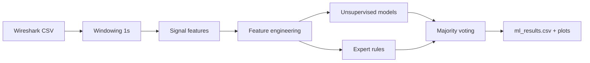

<!-- ===== Project Header ===== -->

<div align="center">

# FlowSense-IDS

Hybrid network traffic anomaly detection from time-window signals.

<!-- Badges -->


<!-- Quick Links -->
<a href="#quick-start">Quick start</a> •
<a href="#pipeline">Pipeline</a> •
<a href="#signals-used">Signals</a> •
<a href="#outputs">Outputs</a> •
<a href="#limitations">Limitations</a>

</div>

---

## Overview

FlowSense-IDS is a small, course-friendly pipeline that converts packet logs into discrete-time signals (fixed windows) and flags suspicious windows using multiple unsupervised methods plus simple expert rules. The focus is on clarity, explainability, and presentation-ready outputs rather than production deployment.

## Highlights

| Item | Description |
|---|---|
| Goal | Flag unusual traffic windows using signals + hybrid detection |
| Input | Wireshark-exported CSV mapped with `columns.json` |
| Output | `ml_results.csv` + plots (timeline, model comparison, correlations) |
| Approach | Unsupervised models + expert rules + majority voting |

---

## Pipeline


**Flow**:  
> Wireshark CSV → windowing (1 second) → signal features → feature engineering → unsupervised models + expert rules → majority voting → results (CSV + plots)

**Why signals + hybrid approach**:  
> Network traffic becomes easier to analyze when aggregated into fixed windows, where changes in intensity, diversity, and timing show up as simple signal statistics. A hybrid setup reduces reliance on a single model and produces outputs that are easier to justify in a report (votes, scores, and rule-based labels).

---

## Signals used

| Signal | What it captures | Why it helps |
|---|---|---|
| Packet count | Traffic intensity / bursts | Detect spikes and surges |
| Traffic volume | Bytes per window | Separates many-small vs few-large packets |
| Unique source IPs | Source diversity | Multi-source patterns |
| Source IP entropy | Concentration vs spread | Identifies skewed vs diverse sources |
| Time-interval variance | Timing irregularity | Bursty vs stable behavior |

---

## Quick start

### 1) Install

**Ubuntu/Linux**:
```bash
pip3 install -r requirements.txt
```
**Windows/macOS**:
```bash
pip install -r requirements.txt
```

### 2) Build signals
```bash
python src/signal.py
```

### 3) Run detection
```bash
python src/ml_model.py
```
---
## Outputs

- `network_signals.csv` (generated): Window-level signals and basic features
- `ml_results.csv` (generated): Final results including:
  - `prediction` (1 = normal, -1 = anomaly)
  - `votes` (0..4)
  - `anomaly_score` (0..100)

Plots (generated):
- `assets/anomaly_detection_complete.png`
- `assets/model_comparison.png`
- `assets/feature_correlation.png`

<details>
  <summary>Column glossary (ml_results.csv)</summary>

- `prediction`: Final ensemble decision per window
- `votes`: How many detectors voted anomaly
- `anomaly_score`: Combined score (higher means more suspicious)
- `attack_type`: Expert-rule label (interpret as "X-like")

</details>
