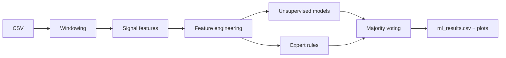

<!-- ===== Project Header ===== -->

<div align="center">

# FlowSense-IDS

<p align="center">
  
</p>


<!-- Quick Links -->
<p align="center">
  <a href="#overview"></a>
  <a href="#quick-start"></a>
  <a href="#signal-extraction"></a>
  <a href="#machine-learning"></a>
  <a href="#outputs"></a>
  <a href="#limitations"></a>
</p>

</div>

---
## 🔷 Overview

**FlowSense-IDS** is a small, course-friendly pipeline that converts packet logs into discrete-time signals (fixed windows) and flags suspicious windows using multiple unsupervised methods plus simple expert rules. The focus is clarity, explainability, and presentation-ready outputs rather than production deployment.

### Highlights

| Item | Description |
|---|---|
| Goal | Flag unusual traffic windows using signals + hybrid detection |
| Input | Wireshark-exported CSV mapped with columns.json |
| Output | ml_results.csv + plots (timeline, model comparison, correlations) |
| Approach | Unsupervised models + expert rules + majority voting |

### Pipeline


**Flow**:  
> Wireshark CSV → windowing (1 second) → signal features → feature engineering → unsupervised models + expert rules → majority voting → results (CSV + plots)

**Why signals + hybrid approach**:  
> Aggregating traffic into fixed windows makes intensity, diversity, and timing changes visible as simple signal statistics; combining multiple detectors improves robustness and produces more defensible outputs (votes, scores, and rule-based labels)

### Signals used

| Signal | What it captures | Why it helps |
|---|---|---|
| Packet count | Traffic intensity / bursts | Detect spikes and surges |
| Traffic volume | Bytes per window | Separates many-small vs few-large packets |
| Unique source IPs | Source diversity | Multi-source patterns |
| Source IP entropy | Concentration vs spread | Identifies skewed vs diverse sources |
| Time-interval variance | Timing irregularity | Bursty vs stable behavior |

### ML models used

| Model | Type | Purpose |
|---|---|---|
| Isolation Forest | Unsupervised | Detects outliers based on isolation |
| One-Class SVM | Unsupervised | Learns a boundary of normal behavior and flags deviations |
| KMeans | Clustering | Distance-based anomaly detection |
| Expert rules | Rule-based | Threshold-based labeling for interpretability |
| Ensemble voting | Fusion | Combines all detectors (majority vote) |

---

## 🔷 Quick start

### 1) Install

**Ubuntu/Linux**:
```bash
pip3 install -r requirements.txt
```
**Windows/macOS**:
```bash
pip install -r requirements.txt
```

### 2) Build signals
```bash
python src/signal.py
```

### 3) Run detection
```bash
python src/ml_model.py
```

---

## 🔷 Signal extraction
> (signal.py) — block by block

#### 1) Config: load mapping 
This part solves a practical issue: Wireshark CSV exports don’t always have the same column names (they vary by version, language, and export settings). Instead of hard-coding fragile column names inside the program, you load a JSON “translation layer” that maps whatever the CSV contains to your own stable schema.


```python
    MAPPING_FILE = "columns.json"
    CSV_FILE = "test.wireshark.csv"
    OUT_FILE = "network_signals.csv"

    try:
        with open(MAPPING_FILE, "r", encoding="utf-8") as f:
            column_map = json.load(f)
    except FileNotFoundError:
        print(f"Error: Mapping file '{MAPPING_FILE}' not found!")
        raise
    except json.JSONDecodeError as e:
        print(f"Error: '{MAPPING_FILE}' is not valid JSON: {e}")
        raise
```
Conceptually, this separates “format compatibility” from “signal logic.” If the CSV headers change later, you update only `columns.json`, not the feature-engineering code. The explicit error handling is a correctness guarantee: if the mapping file is missing or invalid, the pipeline stops early rather than producing a clean-looking but wrong dataset.  

Key implementation notes:
> - The `try/except` ensures “fail fast”: if the mapping file is missing or malformed, the pipeline stops early instead of producing a wrong dataset silently.  
> - `encoding="utf-8"` avoids issues if the JSON file ever contains non-ASCII characters

##

#### 2) Read CSV
This block is the ingestion gate that converts the exported file into a structured table (a DataFrame). Everything downstream assumes the table exists and contains rows (packets) and columns (fields), so this stage validates that assumption first.


```python
    try:
        df = pd.read_csv(CSV_FILE)
    except FileNotFoundError:
        print(f"Error: File '{CSV_FILE}' not found!")
        raise
    except pd.errors.EmptyDataError:
        print("Error: CSV file is empty!")
        raise
```
Conceptually, it’s about making failure explicit and early. If the file is missing or empty, stopping is the correct behavior because any computed signals would be meaningless yet still look “valid” (for example, a file full of zeros). Keeping this stage simple also makes the pipeline easier to explain: “load data once, then process it.”

Key implementation notes:
> - `pd.read_csv` is the single source of truth loader here; everything downstream depends on having a valid table.
> - You handle the two most common failure cases explicitly: missing file and empty file.

##

#### 3) Rename columns to a standard schema
This part creates a stable internal contract for your data. After renaming, the rest of your code can assume the same column names every time (`time`, `source`, `length`, etc.), no matter what the original CSV header labels were.


```python
    df = df.rename(columns=column_map)

    REQUIRED = {"no", "time", "source", "length"}
    missing = REQUIRED - set(df.columns)
    if missing:
        raise ValueError(
            f"Missing required columns after renaming: {missing}\n"
            f"Available columns: {list(df.columns)}\n"
            f"Check your '{MAPPING_FILE}'."
        )

    df = df[list(REQUIRED)]
```
Conceptually, you are building a clean boundary between the messy outside world (CSV exports) and the clean inside world (your analysis pipeline). The required-column check is critical: it prevents confusing downstream errors by validating the schema upfront and giving a clear, actionable message if something is wrong.

Key implementation notes:
> - The “missing required columns” error is presentation-friendly because it prints both what is missing and what is available
> - Using a set for `REQUIRED` is fine for validation, but `df = df[list(REQUIRED)]` can reorder columns unpredictably; for stable ordering, use a list like `["no","time","source","length"]`.

##

#### 4) Cleaning
Cleaning turns “CSV text” into reliable numeric and categorical values that you can safely aggregate. Real CSV exports often contain missing values, non-numeric strings, or inconsistent formatting, and those issues can break computations or distort results.


```python
    df["time"] = pd.to_numeric(df["time"], errors="coerce")
    df["length"] = pd.to_numeric(df["length"], errors="coerce").fillna(0)
    df["source"] = df["source"].fillna("UNKNOWN")

    df = df.dropna(subset=["time"])

    if len(df) == 0:
        raise ValueError("No valid rows after cleaning (time is all invalid).")
```
Conceptually, you are making the dataset machine-usable. Time must be numeric because it defines your entire timeline; length must be numeric because you sum bytes; source should not be null because grouping and diversity metrics depend on consistent categories. Dropping rows with invalid time is principled: if a packet cannot be placed on the timeline, it cannot contribute to time-window signals.


Key implementation notes:
> - `errors="coerce"` is ideal for messy CSV exports: bad values become NaN, then you drop only rows where time is invalid.
> - Lengths that fail conversion become 0, which prevents crashes and keeps aggregation consistent.
> - Filling `source` with `"UNKNOWN"` preserves row count and makes “missing source” explicit instead of silently dropping packets.

##

#### 5) Build shared time windows
This is the key transformation that turns packet logs into a time-series dataset. Packets arrive at irregular continuous timestamps, but signal extraction needs discrete, comparable bins so every second (or window) becomes one observation.

```python
    times = df["time"]
    n = pd.Series(np.floor(times).astype(int), index=times.index)

    min_n = int(n.min())
    max_n = int(n.max())
    global_index = range(min_n, max_n + 1)

    source_ip = df["source"]
    size = df["length"]
```

Conceptually, you are defining the sampling grid for your signals. By flooring time to integer seconds, every packet is assigned to a 1-second window, turning “events in time” into “counts and statistics per window.” Building a continuous global index from the first to last window matters because gaps become meaningful zeros (no traffic) rather than missing timestamps that can confuse plots and models.

Key implementation notes:
> - `np.floor(time)` defines the 1-second window ID; it is simple, explainable, and consistent.
> - `global_index` guarantees a continuous timeline; gaps become explicit zeros instead of missing rows, which is crucial for plotting and ML.
> - Keeping `source_ip` and `size` as separate Series makes later groupby operations clearer.

##

#### 6) Core helper: basic_signal
This helper enforces a strong invariant: every signal must align to the same global time axis and provide a value for every time window. Without that, features can end up with different lengths or missing windows, making merges error-prone and creating subtle bugs.

```python
    def basic_signal(compute_function):
        signal = compute_function(n)
        return signal.reindex(global_index, fill_value=0)
```

Conceptually, this is output standardization. Each signal function focuses only on its definition (count, sum, entropy, timing variability), and the helper handles alignment and missing-window behavior. Filling missing windows with zero is also a semantic choice: “no packets happened” becomes a real value, not “unknown.”

Key implementation notes:
> - `reindex(..., fill_value=0)` is the main reason your signals are comparable and stackable in a single output table.
> - This also makes downstream ML simpler because it never has to deal with missing time windows.

##

#### 7) Signal: packet_count
This feature measures traffic intensity: how many packets arrive in each second. It is simple, intuitive, and extremely useful for detecting sudden spikes, bursts, or drops in activity.


```python
    def packet_count():
        return basic_signal(lambda n: n.value_counts().sort_index())
```
Conceptually, packet_count is “event frequency” in time-series terms. Many network anomalies show up as changes in frequency, such as abrupt surges (flood-like behavior) or sudden silence (outage). It also provides context for other signals, like distinguishing “many small packets” from “few large packets” when combined with volume.

Key implementation notes:
> - `value_counts()` on the window index is an efficient way to count packets per second.
> - `sort_index()` keeps windows in chronological order before reindexing.

##

#### 8) Signal: traffic_volume
This feature measures total bytes per second. It answers a different question than packet_count: not “how many packets,” but “how much data moved.”

```python
    def traffic_volume():
        return basic_signal(lambda n: size.groupby(n).sum())
```

Conceptually, traffic_volume is a coarse throughput measure. Two windows can have the same packet_count but very different byte totals, which often indicates very different behavior (control chatter versus bulk transfer). When you present it, it pairs naturally with packet_count to explain traffic shape and load.

Key implementation notes:
> - `size.groupby(n).sum()` directly implements “bytes per window”.
> - Together with packet_count, it enables derived features like average packet size later.

##

#### 9) Signal: source_entropy
This feature quantifies how concentrated or diverse the source distribution is within each time window using Shannon entropy, \(H = -\sum p_i \log_2(p_i)\). It goes beyond simply counting unique sources by considering whether traffic is dominated by one source or spread evenly among many.


```python
    def source_entropy():
        def calculate_entropy(ip_list):
            ip_list = ip_list.dropna()
            if len(ip_list) == 0:
                return 0.0
            counts = ip_list.value_counts()
            p = counts / counts.sum()
            p = p[p > 0]
            return float(-(p * np.log2(p)).sum())

        return basic_signal(lambda n: source_ip.groupby(n).apply(calculate_entropy))
```
Conceptually, entropy answers: “Is the traffic coming mainly from one sender, or from many senders with similar contribution?” Low entropy means concentration; high entropy means diversity and balance. This is powerful in analysis because it captures distribution shape, not just the number of categories.

Key implementation notes:
> - Conceptually, you compute Shannon entropy `H = -sum(p log2 p)`, which is easy to justify in a report
> - The empty-window guard returns 0.0 so the signal stays numeric and safe for ML
> - `p = p[p > 0]` is defensive; it avoids log issues if any zero probabilities appear

##

#### 10) Signal: unique_source_ip
This feature counts how many distinct sources appear per second. It is an easy-to-explain diversity indicator and provides an immediate sense of how many different senders were active.


```python
    def unique_source_ip():
        return basic_signal(lambda n: source_ip.groupby(n).nunique())
```
Conceptually, it answers: “How many unique talkers were present in this window?” It complements entropy: unique_source_ip measures diversity by presence, while entropy measures diversity by balance. Two windows can have the same number of unique sources but different entropy if one source dominates packet share.

Key implementation notes:
> - `nunique()` is the cleanest definition of “source diversity” at window level.
> - This pairs well with entropy: unique counts “how many”, entropy captures “how evenly distributed”.

##

#### 11) Signal: time_interval_variance
This feature measures timing irregularity inside each second by computing the variance of inter-arrival times. It looks at how packets are spaced within the window, not just how many there are.


```python
    def time_interval_variance():
        def calculate_variance(time_list):
            if len(time_list) < 2:
                return 0.0
            sorted_time = time_list.sort_values()
            dt = sorted_time.diff().dropna()
            if len(dt) == 0:
                return 0.0
            return float(dt.var())

        return basic_signal(lambda n: times.groupby(n).apply(calculate_variance))
```
Conceptually, it distinguishes regular patterns from bursty patterns even when packet_count is the same. For example, 20 packets evenly spaced and 20 packets arriving in clumps are different behaviors; this feature helps separate them. Returning \(0\) when there are fewer than two packets is principled because inter-arrival variability cannot be defined without at least two timestamps.

Key implementation notes:
> - Sorting timestamps then taking `diff()` is the correct way to compute inter-arrival gaps
> - The `< 2` guard is important because variance is undefined with fewer than 2 samples
> - Returning 0.0 on sparse windows keeps the feature stable and avoids NaNs

##

#### 12) Compute & save
This block assembles all computed signals into a single aligned feature table and exports it for downstream use. The key concept is alignment: every row corresponds to one time window, and every column is a signal value for that same window.


```python
    print("Calculating signals...")

    pcount = packet_count()
    tvolume = traffic_volume()
    sentropy = source_entropy()
    usip = unique_source_ip()
    tivariance = time_interval_variance()

    all_signals = pd.DataFrame({
        "time_window": list(global_index),
        "packet_count": pcount.values,
        "traffic_volume": tvolume.values,
        "source_ip_entropy": sentropy.values,
        "unique_source_ip": usip.values,
        "time_variance": tivariance.values
    }).fillna(0)

    all_signals.to_csv(OUT_FILE, index=False)

    print("Done.")
    print(f"Saved: {OUT_FILE} | rows={len(all_signals)}")
```
Conceptually, this is the point where you move from raw events (packets) to an ML-ready dataset (a time-series feature matrix). Exporting to CSV finalizes a clean pipeline boundary: capture and mapping produce inputs, signal extraction produces features, and later stages (visualization or ML) consume the output reliably.

Key implementation notes:
> - Building one DataFrame with a shared `time_window` axis makes the output easy to plot, debug, and feed to ML.
> - `.fillna(0)` is a final safety net, although basic_signal already prevents missing windows in most cases.
> - Printing the saved path and row count helps during demos and debugging.

---

## 🔷 Machine learning 
> (ml_model.py) — block by block

#### 1) Imports
This block brings in everything needed for an end-to-end anomaly detection pipeline: data handling, numeric operations, unsupervised anomaly models, clustering, feature scaling, and plotting. Conceptually, you can think of it as assembling a toolbox: pandas and numpy for building the dataset, scikit-learn for “learning what normal looks like” without labels, and matplotlib/seaborn for turning results into evidence you can show in a presentation.

The important idea is separation of concerns: ML models should not care about CSV parsing details, and visualizations should not change the detection logic. Imports make those layers available while keeping the rest of the file focused on the pipeline story.

```python
    import pandas as pd
    import numpy as np
    from sklearn.ensemble import IsolationForest
    from sklearn.svm import OneClassSVM
    from sklearn.cluster import KMeans
    from sklearn.preprocessing import StandardScaler
    import matplotlib.pyplot as plt
    import seaborn as sns
```

Key implementation notes:
> - `IsolationForest` and `OneClassSVM` are classic `unsupervised anomaly detectors`, meaning they do not require ground-truth attack labels
> - `StandardScaler` is essential because these models are sensitive to feature scale (bytes, counts, entropy are on very different ranges)

##

#### 2) Config
This block defines the “knobs” of your system: input/output paths and the main hyperparameters that control behavior. Conceptually, this turns the script from a one-off experiment into a reproducible pipeline: you can rerun it, compare results, and tune it without touching core logic.

TRAIN_RATIO defines a time-based split, which is crucial for time-series realism: you train on earlier windows and test on later windows. VOTE_THRESHOLD defines the ensemble policy: how much agreement you require before calling something an anomaly. RANDOM_STATE ensures deterministic behavior so your demo and report do not change every run.

```python
    CSV_FILE = "network_signals.csv"
    OUT_FILE = "ml_results.csv"

    TRAIN_RATIO = 0.7
    VOTE_THRESHOLD = 2
    RANDOM_STATE = 42
```

Key implementation notes:
> - Time-based splitting avoids leaking future patterns into the past, which would inflate performance artificially.
> - `VOTE_THRESHOLD = 2` means “majority voting” in a 4-model ensemble (at least 2 agree).

##

#### 3) Load Data
This block loads the signal table produced by the previous stage and enforces a minimum quality check: the dataset must exist and must not be empty. Conceptually, this is the boundary between feature extraction and decision-making: from here on, you treat each time window as one sample with measurable features.

The printed header is not cosmetic; it is operational. In real demos and debugging, clear stage prints help you prove that the pipeline ran end-to-end and where it would fail if something is wrong.

```python
    print("="*60)
    print("NETWORK ANOMALY DETECTION - ML PIPELINE")
    print("="*60)

    print("\nLoading data...")

    try:
        signals = pd.read_csv(CSV_FILE)
    except FileNotFoundError:
        print(f"Error: File '{CSV_FILE}' not found!")
        raise

    if len(signals) == 0:
        raise ValueError("Error: Empty dataset!")
```

Key implementation notes:
> - Failing fast here prevents producing plots and CSV outputs that look valid but are built from no data.
> - Reading from `network_signals.csv` keeps the ML stage independent from raw packet parsing.

##

#### 4) Feature Engineering
This block upgrades basic signals into a richer feature set that captures ratios, trends, variability, and sudden changes. Conceptually, anomalies are rarely defined by a single number; they are patterns over time. Feature engineering converts raw measurements into “behavior descriptors” that models can learn more reliably.

You create three main feature families:
- Ratio features to normalize effects (like volume versus count).
- Rolling features to capture local baseline and volatility over time.
- Rate-of-change features to detect abrupt transitions.

```python
    print("\nFeature engineering...")

    features_basic = ['packet_count', 'traffic_volume', 'source_ip_entropy', 
                      'unique_source_ip', 'time_variance']

    # Ratio features
    signals['avg_packet_size'] = signals['traffic_volume'] / (signals['packet_count'] + 1)
    signals['entropy_per_ip'] = signals['source_ip_entropy'] / (signals['unique_source_ip'] + 1)

    # Rolling features (temporal patterns)
    for w in [5, 10, 30]:
        signals[f'packet_ma{w}'] = signals['packet_count'].rolling(w).mean().fillna(0)
        signals[f'packet_std{w}'] = signals['packet_count'].rolling(w).std().fillna(0)

    # Rate of change
    signals['packet_change'] = signals['packet_count'].diff().fillna(0)

    features_all = features_basic + [
        'avg_packet_size', 'entropy_per_ip',
        'packet_ma5', 'packet_std5', 'packet_ma10', 'packet_std10', 'packet_ma30', 'packet_std30',
        'packet_change'
    ]

    print(f"  Created {len(features_all)} features")
```

Key implementation notes:
> - Adding +1 in denominators prevents division-by-zero and keeps features defined even in zero-packet windows.
> - `Rolling` mean and rolling std act like a dynamic baseline: “what is normal around here” changes over time.
> - `packet_change` highlights sudden bursts that might be missed when only looking at absolute count.

##

#### 5) Train/Test Split (Time-based) + Normalization
This block enforces a realistic evaluation setup and prevents data leakage during scaling. Conceptually, in time-series anomaly detection, you must not learn from the future. You train on earlier windows (assumed mostly normal) and test on later windows (where anomalies can appear).

Normalization is handled correctly: you fit the scaler only on the training portion, then apply the same transformation to test and full data. This mirrors production, where you would learn scaling parameters from historical normal traffic and apply them to new incoming windows.

```python
    print("\nSplitting data (time-based)...")

    train_size = int(TRAIN_RATIO * len(signals))
    train_indices = range(0, train_size)
    test_indices = range(train_size, len(signals))

    print(f"  Train: {train_size} windows ({TRAIN_RATIO*100:.0f}%)")
    print(f"  Test:  {len(signals)-train_size} windows ({(1-TRAIN_RATIO)*100:.0f}%)")

    # Normalization (fit on train only!)
    scaler = StandardScaler()
    X_train = scaler.fit_transform(signals.loc[train_indices, features_all])
    X_test = scaler.transform(signals.loc[test_indices, features_all])
    X_all = scaler.transform(signals[features_all])
```

Key implementation notes:
> - Fitting StandardScaler on all data would leak test distribution information into training
> - X_all is useful for producing final predictions and plots aligned with the full timeline

##

#### 6) Layer 1: ML Models (IsolationForest + OneClassSVM)
This block trains unsupervised anomaly detectors that learn a boundary around normal behavior. Conceptually, you are building two independent “opinions” about what looks abnormal:
- IsolationForest flags points that are easy to isolate with random partitions (outliers)
- OneClassSVM learns a tight boundary around the bulk of data in feature space

These models output labels of 1 (normal) and -1 (anomaly). Printing anomaly counts for train and test gives immediate sanity checks: if train anomalies are extremely high, your contamination or features might be misconfigured.

```python
    print("\n" + "="*60)
    print("TRAINING ML MODELS")
    print("="*60)

    models = {
        'IsolationForest': IsolationForest(contamination=0.1, random_state=RANDOM_STATE, n_estimators=100),
        'OneClassSVM': OneClassSVM(nu=0.1, kernel='rbf', gamma='auto')
    }

    predictions_train = {}
    predictions_test = {}
    predictions_all = {}

    for name, model in models.items():
        print(f"\n{name}...")
        model.fit(X_train)
        
        predictions_train[name] = model.predict(X_train)
        predictions_test[name] = model.predict(X_test)
        predictions_all[name] = model.predict(X_all)
        
        train_anomalies = (predictions_train[name] == -1).sum()
        test_anomalies = (predictions_test[name] == -1).sum()
        print(f"  Train: {train_anomalies} anomalies ({train_anomalies/len(train_indices)*100:.1f}%)")
        print(f"  Test:  {test_anomalies} anomalies ({test_anomalies/len(test_indices)*100:.1f}%)")

    # Get IF decision scores for anomaly scoring
    if_model = models['IsolationForest']
    if_scores_all = if_model.decision_function(X_all)
```

Key implementation notes:
> - `contamination` and `nu` both act like “expected anomaly proportion” controls, so they directly influence how aggressive the detector is.
> - `decision_function` from `IsolationForest` provides a continuous score you later convert into a normalized `anomaly_score`.

##

#### 7) Layer 2: Clustering (KMeans distance as anomaly)
This block adds a different perspective: instead of learning a boundary, you learn prototypes of normal behavior. Conceptually, KMeans finds a few typical traffic regimes (clusters), such as low activity, medium activity, and high activity periods.

Then you treat “far from all learned clusters” as suspicious. This is a strong idea for presentations because it is intuitive: if a window does not resemble any known normal pattern, it is likely anomalous. The threshold is learned from training distances (90th percentile), making the rule data-driven instead of arbitrary.

```python
    print("\n" + "="*60)
    print("CLUSTERING ANALYSIS")
    print("="*60)

    print("\nKMeans clustering...")

    kmeans = KMeans(n_clusters=3, random_state=RANDOM_STATE)
    kmeans.fit(X_train)

    # Distance-based anomaly detection
    distances_all = np.min(kmeans.transform(X_all), axis=1)
    threshold_kmeans = np.percentile(distances_all[train_indices], 90)

    print(f"  Distance threshold: {threshold_kmeans:.3f}")

    predictions_train['KMeans'] = np.where(distances_all[train_indices] > threshold_kmeans, -1, 1)
    predictions_test['KMeans'] = np.where(distances_all[test_indices] > threshold_kmeans, -1, 1)
    predictions_all['KMeans'] = np.where(distances_all > threshold_kmeans, -1, 1)

    print(f"  Train: {(predictions_train['KMeans']==-1).sum()} anomalies")
    print(f"  Test:  {(predictions_test['KMeans']==-1).sum()} anomalies")
```

Key implementation notes:
> - Using the minimum distance to cluster centers implements “closest normal regime”.
> - Learning the threshold from training data adapts to each capture and avoids hard-coded distance cutoffs.

##

#### 8) Layer 3: Expert System (Rule-based AI)
This block adds human logic on top of ML. Conceptually, ML models can say “this looks weird,” but a rule system can explain “what kind of weird” using domain patterns like DDoS-like, scan-like, bot-like, exfiltration-like, or spike-like behavior.

Crucially, your rules are not fixed constants; you learn thresholds from the training distribution using quantiles. That makes the expert system adaptive: what counts as “high packet count” depends on the baseline traffic in that specific dataset.

```python
    print("\n" + "="*60)
    print("EXPERT SYSTEM (Rule-Based AI)")
    print("="*60)

    # Learn thresholds from training data
    q95_packet = signals.loc[train_indices, 'packet_count'].quantile(0.95)
    q95_ip = signals.loc[train_indices, 'unique_source_ip'].quantile(0.95)
    q25_size = signals.loc[train_indices, 'avg_packet_size'].quantile(0.25)
    q05_entropy = signals.loc[train_indices, 'source_ip_entropy'].quantile(0.05)
    q95_volume = signals.loc[train_indices, 'traffic_volume'].quantile(0.95)
    q75_ma = signals.loc[train_indices, 'packet_ma30'].quantile(0.75)

    print(f"\nLearned thresholds from training data:")
    print(f"  High packet count: > {q95_packet:.1f}")
    print(f"  High unique IPs: > {q95_ip:.1f}")
    print(f"  Low packet size: < {q25_size:.1f}")
    print(f"  Low entropy: < {q05_entropy:.2f}")


    def expert_system(row):
        """
        Rule-based AI with data-driven thresholds.
        Returns (score, attack_type).
        """
        score = 0
        attack_type = "Normal"
        
        # Rule 1: DDoS (high packets + many IPs)
        if row['packet_count'] > q95_packet and row['unique_source_ip'] > q95_ip:
            score += 5
            attack_type = "DDoS"
        
        # Rule 2: Port Scan (many small packets, few IPs)
        elif row['packet_count'] > q95_packet and row['avg_packet_size'] < q25_size:
            score += 4
            attack_type = "Port_Scan"
        
        # Rule 3: Botnet (low entropy + sustained traffic)
        elif row['source_ip_entropy'] < q05_entropy and row['packet_ma30'] > q75_ma:
            score += 3
            attack_type = "Botnet"
        
        # Rule 4: Data Exfiltration (high volume, few packets)
        elif row['traffic_volume'] > q95_volume and row['packet_count'] < q95_packet/2:
            score += 4
            attack_type = "Data_Exfiltration"
        
        # Rule 5: Sudden Spike
        elif row['packet_count'] > row['packet_ma30'] + 2 * row['packet_std30'] and row['packet_std30'] > 0:
            score += 2
            attack_type = "Sudden_Spike"
        
        return score, attack_type


    # Apply expert system
    signals[['expert_score', 'attack_type']] = signals.apply(
        lambda row: pd.Series(expert_system(row)), axis=1
    )

    predictions_train['ExpertSystem'] = np.where(signals.loc[train_indices, 'expert_score'] >= 3, -1, 1)
    predictions_test['ExpertSystem'] = np.where(signals.loc[test_indices, 'expert_score'] >= 3, -1, 1)
    predictions_all['ExpertSystem'] = np.where(signals['expert_score'] >= 3, -1, 1)

    print(f"\n  Train: {(predictions_train['ExpertSystem']==-1).sum()} anomalies")
    print(f"  Test:  {(predictions_test['ExpertSystem']==-1).sum()} anomalies")
```

Key implementation notes:
> - Quantile thresholds adapt to baseline traffic, so the rule system generalizes better across different captures
> - `expert_score` provides both detection and interpretability, while `attack_type` gives a human-readable explanation

##

#### 9) Layer 4: Ensemble (Majority Voting)
This block fuses multiple weak-to-strong opinions into a more stable final decision. Conceptually, each detector has a different failure mode:
- `IsolationForest` may over-flag rare but harmless patterns.
- `OneClassSVM` may be sensitive to scaling and boundary shape.
- `KMeans` distance may flag transitions between normal regimes.
- Expert rules may miss novel anomalies.

Majority voting reduces the chance that one model’s bias dominates the final result. Requiring at least VOTE_THRESHOLD votes is a transparent policy you can explain in one sentence during a presentation.

```python
    print("\n" + "="*60)
    print("ENSEMBLE FUSION (Majority Voting)")
    print("="*60)

    # Count how many models voted for anomaly
    votes_train = np.array(list(predictions_train.values()))
    votes_test = np.array(list(predictions_test.values()))
    votes_all = np.array(list(predictions_all.values()))

    anomaly_votes_train = (votes_train == -1).sum(axis=0)
    anomaly_votes_test = (votes_test == -1).sum(axis=0)
    anomaly_votes_all = (votes_all == -1).sum(axis=0)

    # Final decision: if VOTE_THRESHOLD or more models agree → anomaly
    final_prediction_train = np.where(anomaly_votes_train >= VOTE_THRESHOLD, -1, 1)
    final_prediction_test = np.where(anomaly_votes_test >= VOTE_THRESHOLD, -1, 1)
    final_prediction_all = np.where(anomaly_votes_all >= VOTE_THRESHOLD, -1, 1)

    print(f"\nVoting rule: {VOTE_THRESHOLD}+ models agree → Anomaly")
    print(f"  Train: {(final_prediction_train == -1).sum()} anomalies")
    print(f"  Test:  {(final_prediction_test == -1).sum()} anomalies")

    # Store results
    signals['prediction'] = final_prediction_all
    signals['votes'] = anomaly_votes_all

    # Anomaly score: combination of IF decision + expert + distance
    if_score_norm = (if_scores_all - if_scores_all.min()) / (if_scores_all.max() - if_scores_all.min() + 1e-9)
    expert_score_norm = signals['expert_score'] / 5.0
    distance_norm = (distances_all - distances_all.min()) / (distances_all.max() - distances_all.min() + 1e-9)

    signals['anomaly_score'] = (
        (1 - if_score_norm) * 60 +
        expert_score_norm * 30 +
        distance_norm * 10
    )
```

Key implementation notes:
> - votes is a confidence proxy: higher agreement usually means higher trust.
> - The `anomaly_score` is a weighted fusion of three perspectives: outlierness (IF), explainable suspicion (expert), and novelty distance (KMeans).
> - 1e-9 prevents division-by-zero when normalizing constant scores.

##

#### 10) Evaluation
This block summarizes what the system detected on train and test, and provides per-model breakdown plus agreement statistics. Conceptually, in unsupervised anomaly detection you often lack ground truth labels, so evaluation focuses on behavior diagnostics:
- How many anomalies are flagged
- Whether detection rate is stable across train and test
- Whether anomalies have high confidence (more votes, higher score)

The case-study print is extremely useful in a presentation: it turns the pipeline into a story by highlighting the strongest detected anomaly and explaining its traffic characteristics and inferred attack type.

```python
    print("\n" + "="*60)
    print("EVALUATION")
    print("="*60)

    anomalies_train = signals.loc[train_indices][signals.loc[train_indices, 'prediction'] == -1]
    anomalies_test = signals.loc[test_indices][signals.loc[test_indices, 'prediction'] == -1]

    print(f"\nTRAIN SET:")
    print(f"  Total: {len(train_indices)} windows")
    print(f"  Detected: {len(anomalies_train)} anomalies ({len(anomalies_train)/len(train_indices)*100:.1f}%)")

    print(f"\nTEST SET:")
    print(f"  Total: {len(test_indices)} windows")
    print(f"  Detected: {len(anomalies_test)} anomalies ({len(anomalies_test)/len(test_indices)*100:.1f}%)")

    if len(anomalies_test) > 0:
        print(f"  Avg anomaly score: {anomalies_test['anomaly_score'].mean():.1f}/100")
        print(f"  Max anomaly score: {anomalies_test['anomaly_score'].max():.1f}/100")
        print(f"  High confidence (4 votes): {(anomalies_test['votes'] == 4).sum()} cases")
        
        # Case study: strongest anomaly
        print(f"\n  CASE STUDY - Strongest Anomaly:")
        top_anomaly = anomalies_test.loc[anomalies_test['anomaly_score'].idxmax()]
        print(f"     Time window: {int(top_anomaly['time_window'])} seconds")
        print(f"     Packets: {int(top_anomaly['packet_count'])}")
        print(f"     Unique IPs: {int(top_anomaly['unique_source_ip'])}")
        print(f"     Traffic: {int(top_anomaly['traffic_volume'])} bytes")
        print(f"     Attack type: {top_anomaly['attack_type']}")
        print(f"     Anomaly score: {top_anomaly['anomaly_score']:.1f}/100")
        print(f"     Model votes: {int(top_anomaly['votes'])}/4")

    print("\n--- Per Model Detection (Test Set) ---")
    for name in ['IsolationForest', 'OneClassSVM', 'KMeans', 'ExpertSystem']:
        count = (predictions_test[name] == -1).sum()
        print(f"  {name:20s}: {count:3d} anomalies")
    print(f"  {'Ensemble (2+ votes)':20s}: {(final_prediction_test == -1).sum():3d} anomalies")

    print("\n--- Model Agreement (Test Set) ---")
    all_agree = (anomaly_votes_test == 4).sum()
    majority = (anomaly_votes_test >= 2).sum()
    print(f"  All 4 models agree: {all_agree} windows")
    print(f"  2+ models agree: {majority} windows")

    print("\n--- Attack Types Detected (All Data) ---")
    attack_counts = signals[signals['prediction'] == -1]['attack_type'].value_counts()
    for attack, count in attack_counts.items():
        print(f"  {attack}: {count}")
```

Key implementation notes:
> - Without labels, these diagnostics help you tune sensitivity and check for obvious miscalibration
> - Agreement metrics `(all 4, 2+ votes)` serve as an interpretable confidence report

##

#### 11) Save Results
This block exports the enriched table (features plus predictions, votes, scores, and attack types) so you can analyze results without rerunning training. Conceptually, you are persisting the model’s decisions alongside the evidence that produced them, which is important for reproducibility and reporting.

```python
    signals.to_csv(OUT_FILE, index=False)
    print(f"\n✓ Results saved: {OUT_FILE}")
```

Key implementation notes:
> - Saving the full signals table makes it easy to debug: you can inspect what feature values caused a specific anomaly flag

##

#### 12) Plot Theme (Dark / Professional)
This block defines a consistent visual identity: colors, fonts, background, grid styling, and legend style. Conceptually, this matters because anomaly detection outputs are often questioned; clean visuals improve trust and readability, especially when you show a timeline with highlighted anomalies.

You centralize styling so every plot looks coherent. That is a professional pattern: define theme once, generate multiple figures consistently.

```python
    plt.style.use("dark_background")

    # Color palette (smoky dark theme)
    BG = "#0d1117"
    PANEL = "#161b22"
    GRID = "#30363d"
    TEXT = "#c9d1d9"
    MUTED = "#8b949e"
    SPLIT = "#6e7681"

    NORMAL = "#58a6ff"
    ANOMALY = "#f85149"
    SCORE = "#ffa657"
    VOLUME = "#56d364"

    # Font settings (DejaVu Sans - professional & readable)
    plt.rcParams.update({
        "font.family": "DejaVu Sans",
        "font.size": 11,
        "axes.titlesize": 14,
        "axes.labelsize": 12,
        "axes.titleweight": "bold",
        "xtick.labelsize": 10,
        "ytick.labelsize": 10,
        "legend.fontsize": 10,
        
        "figure.facecolor": BG,
        "axes.facecolor": PANEL,
        "savefig.facecolor": BG,
        "axes.edgecolor": GRID,
        "axes.labelcolor": TEXT,
        "xtick.color": MUTED,
        "ytick.color": MUTED,
        "text.color": TEXT,
        "grid.color": GRID,
        "grid.alpha": 0.3,
        "axes.grid": True,
        
        "legend.frameon": True,
        "legend.facecolor": PANEL,
        "legend.edgecolor": GRID,
    })
```

Key implementation notes:
> - SPLIT color supports a clear train/test split marker in time-series plots
> - Using fixed palette names (NORMAL, ANOMALY, SCORE, VOLUME) keeps plotting code readable

##

#### 13) Visualizations
This block turns detections into three kinds of evidence:
- A timeline view that shows traffic, anomaly score, and volume with anomalies highlighted
- A model comparison bar chart for test-set anomaly counts
- A correlation heatmap to explain feature relationships and potential redundancy

Conceptually, the first plot is your main story slide: it ties the raw behavior (packet count, volume) to the system’s decision (anomaly score, anomaly points). The other two plots are supporting slides: “how models differ” and “what features are related.”

```python
    print("\n" + "="*60)
    print("GENERATING VISUALIZATIONS")
    print("="*60)

    anomalies_all = signals[signals['prediction'] == -1]

    # Plot 1: Main timeline
    fig, axes = plt.subplots(3, 1, figsize=(16, 10))

    # Packet count
    axes[0].plot(
        signals['time_window'], signals['packet_count'],
        alpha=0.85, color=NORMAL, linewidth=1.8, label='Traffic'
    )
    axes[0].axvline(
        x=signals.loc[train_size-1, 'time_window'],
        color=SPLIT, linestyle='--', linewidth=2, alpha=0.7, label='Train/Test Split'
    )
    axes[0].scatter(
        anomalies_all['time_window'], anomalies_all['packet_count'],
        c=anomalies_all['anomaly_score'], cmap='Reds', s=100,
        edgecolors=PANEL, linewidths=1, label='Anomaly', zorder=5
    )
    axes[0].set_ylabel('Packet Count', fontsize=12, color=TEXT)
    axes[0].legend(loc='upper right', framealpha=0.95)
    axes[0].set_title('Network Anomaly Detection - Hybrid AI System', fontsize=14, fontweight='bold', color=TEXT, pad=15)

    # Anomaly score
    axes[1].fill_between(
        signals['time_window'], 0, signals['anomaly_score'],
        alpha=0.4, color=SCORE
    )
    axes[1].axvline(
        x=signals.loc[train_size-1, 'time_window'],
        color=SPLIT, linestyle='--', linewidth=2, alpha=0.7
    )
    axes[1].set_ylabel('Anomaly Score', fontsize=12, color=TEXT)

    # Traffic volume
    axes[2].plot(
        signals['time_window'], signals['traffic_volume'],
        alpha=0.85, color=VOLUME, linewidth=1.6
    )
    axes[2].axvline(
        x=signals.loc[train_size-1, 'time_window'],
        color=SPLIT, linestyle='--', linewidth=2, alpha=0.7
    )
    axes[2].scatter(
        anomalies_all['time_window'], anomalies_all['traffic_volume'],
        color=ANOMALY, s=80, edgecolors=PANEL, linewidths=1, zorder=5
    )
    axes[2].set_xlabel('Time Window (seconds)', fontsize=12, color=TEXT)
    axes[2].set_ylabel('Traffic Volume (bytes)', fontsize=12, color=TEXT)

    plt.tight_layout()
    plt.savefig('anomaly_detection_complete.png', dpi=300, bbox_inches='tight', facecolor=BG)
    print("  ✓ Saved: anomaly_detection_complete.png")

    # Plot 2: Model comparison
    fig, ax = plt.subplots(figsize=(10, 6))
    model_counts = {}
    for name in ['IsolationForest', 'OneClassSVM', 'KMeans', 'ExpertSystem']:
        model_counts[name] = (predictions_test[name] == -1).sum()
    model_counts['Ensemble'] = (final_prediction_test == -1).sum()

    colors_bars = [NORMAL, '#9ecbff', '#7ee787', '#d2a8ff', SCORE]
    bars = ax.bar(
        model_counts.keys(), model_counts.values(),
        color=colors_bars, edgecolor=GRID, linewidth=1.5
    )
    ax.set_ylabel('Anomalies Detected (Test Set)', fontsize=12, color=TEXT)
    ax.set_title('Model Comparison', fontsize=14, fontweight='bold', color=TEXT, pad=15)

    for bar in bars:
        height = bar.get_height()
        ax.text(
            bar.get_x() + bar.get_width()/2., height + 0.8,
            f'{int(height)}', ha='center', va='bottom',
            fontweight='bold', fontsize=11, color=TEXT
        )

    plt.xticks(rotation=15, ha='right')
    plt.tight_layout()
    plt.savefig('model_comparison.png', dpi=300, bbox_inches='tight', facecolor=BG)
    print("  ✓ Saved: model_comparison.png")

    # Plot 3: Feature correlation
    fig, ax = plt.subplots(figsize=(10, 8))
    important_features = ['packet_count', 'traffic_volume', 'source_ip_entropy', 
                          'unique_source_ip', 'avg_packet_size', 'anomaly_score']
    corr = signals[important_features].corr()
    sns.heatmap(
        corr, annot=True, fmt='.2f',
        cmap='rocket_r', center=0,
        square=True, linewidths=1.2, linecolor=GRID,
        cbar_kws={"shrink": 0.8},
        annot_kws={"fontsize": 10, "color": "#e6edf3"}
    )
    plt.title('Feature Correlation Matrix', fontsize=14, fontweight='bold', color=TEXT, pad=15)
    plt.tight_layout()
    plt.savefig('feature_correlation.png', dpi=300, bbox_inches='tight', facecolor=BG)
    print("  ✓ Saved: feature_correlation.png")


    plt.show()
```

Key implementation notes:
> - The split line is important for credibility: it shows you did not train on future windows
> - Coloring anomaly points by anomaly_score communicates confidence visually, not just as a number
> - Correlation heatmap helps justify feature choices and can motivate feature reduction later

##

#### 14) Summary
This final block prints a compact completion report. Conceptually, this is your “audit trail”: how many features were engineered, how many models ran, what ensemble rule was used, and how many anomalies were found.

This is helpful in demos because it confirms that the pipeline completed successfully and provides high-level outputs without needing to inspect files immediately.

```python
    print("\n" + "="*60)
    print("PIPELINE COMPLETED SUCCESSFULLY!")
    print("="*60)
    print(f"\n✓ {len(features_all)} features engineered")
    print(f"✓ 4 models trained (IF, SVM, KMeans, Expert)")
    print(f"✓ Majority voting ensemble ({VOTE_THRESHOLD}+ votes)")
    print(f"✓ {len(anomalies_all)} anomalies detected")
    print(f"✓ 3 visualizations generated (dark theme)\n")
```
## 🔷 outputs
### Normal traffic outputs

  


**What this figure shows (conceptually):** This is the main evidence plot, aligned over `time_window`, with three stacked views: `packet_count` (top), `anomaly_score` (middle), and `traffic_volume` (bottom). For normal traffic, the overall “shape” of activity looks consistent over time, and there is no sustained region where the system repeatedly flags anomalies with high confidence.

**How to read it:** Red anomaly points should be rare and mostly isolated. Even if a few windows get flagged, you typically won’t see long consecutive runs of high `anomaly_score`, and spikes in `packet_count` usually have a reasonable matching behavior in `traffic_volume` (not a strange mismatch). The dashed vertical line is the `train/test` split; in normal traffic the pattern after the split remains similar to the pattern before it, which suggests the model is not encountering a new abnormal regime.

**Why a few anomalies can still appear:** Models like `IsolationForest` (with `contamination=0.1`) are designed to label a small fraction of points as outliers by design, so a small number of “soft anomalies” is expected even in benign data. The key is that these points are low-agreement (fewer votes) and do not form a consistent abnormal pattern.

##

  


**What this figure shows (conceptually):** This is a correlation matrix of selected features (e.g., `packet_count`, `traffic_volume`, `source_ip_entropy`, `unique_source_ip`, `avg_packet_size`, `anomaly_score`). It answers one question: “Which features move together, and which provide independent information?”

**How to read it:** Values close to \(1\) mean two features rise and fall together, values close to \(-1\) mean they move oppositely, and values near \(0\) mean they’re mostly independent. In normal traffic, it’s common to see a reasonable positive relationship between `packet_count` and `traffic_volume`, because more packets often means more bytes.

**Why it matters for your pipeline:** If `anomaly_score` strongly correlates with only one basic feature, your detector might effectively be “just a threshold” on that feature. In healthy normal results, `anomaly_score` is usually influenced by multiple signals (intensity, volume, diversity, timing), which supports your “hybrid” claim.

##

  


**What this figure shows (conceptually):** This bar chart compares how many anomalies each detector flagged on the test set: `IsolationForest`, `OneClassSVM`, `KMeans`, `ExpertSystem`, and the final `Ensemble`. It reveals whether any single model is overly aggressive or overly conservative.

**How to read it:** For normal traffic, you typically expect relatively low counts across all models, and the `Ensemble` (majority voting) should be at least as conservative as the noisiest individual model. If one model flags much more than others, it can indicate that model is sensitive to certain benign patterns (for example, `OneClassSVM` can be stricter depending on scaling and boundary shape).

**Why the ensemble result matters:** The ensemble count being low supports the idea that “multiple independent methods agree that most windows are normal,” which is stronger than relying on a single algorithm.

##

### Attack / anomalous traffic outputs

  


**What this figure shows (conceptually):** This is the same 3-layer timeline, but now the data contains injected attack behavior. The core expectation is that anomalies are no longer rare and isolated; instead, you see clusters of flagged windows where the traffic behavior changes in a way that breaks the “normal baseline.”

**How to read it:** Look for sustained regions where red points concentrate, and where `anomaly_score` forms a clear elevated band rather than occasional bumps. In attack traffic, you often see either (a) unusually high `packet_count`, (b) unusual `traffic_volume`, or (c) unusual combinations like high packets with small `avg_packet_size`, or many sources reflected by `unique_source_ip`/`source_ip_entropy` shifts.

**Why this supports detection:** The timeline makes it visually obvious that the model is reacting to a pattern, not random noise. The presence of a coherent abnormal segment after (or across) the `train/test` split suggests the system can generalize beyond the training baseline.

##

  


**What this figure shows (conceptually):** This correlation matrix reflects how relationships between features behave when attack windows exist. Attacks can change which features “move together,” because they often distort traffic structure (timing, volume, diversity) in a non-normal way.

**How to read it:** Compared to the normal case, you may observe stronger or newly emerging correlations (or correlations weakening) between key indicators and `anomaly_score`. For instance, if an attack is volume-driven, `anomaly_score` may align more with `traffic_volume`; if it’s diversity-driven, it may align more with `unique_source_ip` or shifts in `source_ip_entropy`.

**Why it matters for explanation:** This helps you justify that the detector is not using a single cue. Instead, it responds to the multivariate footprint of the attack, which is exactly why your pipeline builds multiple engineered features (ratios, rolling stats, change rates).

##

  


**What this figure shows (conceptually):** This bar chart shows how each component behaves under attack conditions. In a good attack-injected dataset, anomaly counts rise for multiple detectors, and the `Ensemble` should also rise because there is more cross-model agreement.

**How to read it:** If most models detect more anomalies than in the normal scenario, that’s a strong sign the injected behavior is “structurally different.” If only one model spikes while others remain low, it suggests the attack signature aligns with one method’s sensitivity but is not broadly supported, which is useful for tuning.

**Why the ensemble is the final evidence:** An ensemble increase indicates “multiple independent perspectives” (outlier-based, boundary-based, clustering distance, and rule-based reasoning) converge on the same suspicious windows. That is usually your most defensible argument in a presentation.
