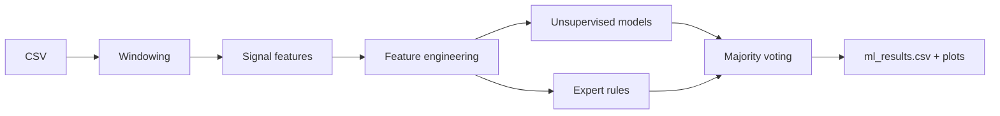

<!-- ===== Project Header ===== -->

<div align="center">

# FlowSense-IDS

<p align="center">
  
</p>


<!-- Quick Links -->
<p align="center">
  <a href="#overview"></a>
  <a href="#quick-start"></a>
  <a href="#signal-extraction"></a>
  <a href="#machine-learning"></a>
  <a href="#outputs"></a>
  <a href="#limitations"></a>
</p>

</div>

---
## Overview

**FlowSense-IDS** is a small, course-friendly pipeline that converts packet logs into discrete-time signals (fixed windows) and flags suspicious windows using multiple unsupervised methods plus simple expert rules. The focus is clarity, explainability, and presentation-ready outputs rather than production deployment.

### Highlights

| Item | Description |
|---|---|
| Goal | Flag unusual traffic windows using signals + hybrid detection |
| Input | Wireshark-exported CSV mapped with columns.json |
| Output | ml_results.csv + plots (timeline, model comparison, correlations) |
| Approach | Unsupervised models + expert rules + majority voting |

### Pipeline


**Flow**:  
> Wireshark CSV → windowing (1 second) → signal features → feature engineering → unsupervised models + expert rules → majority voting → results (CSV + plots)

**Why signals + hybrid approach**:  
> Aggregating traffic into fixed windows makes intensity, diversity, and timing changes visible as simple signal statistics; combining multiple detectors improves robustness and produces more defensible outputs (votes, scores, and rule-based labels)

### Signals used

| Signal | What it captures | Why it helps |
|---|---|---|
| Packet count | Traffic intensity / bursts | Detect spikes and surges |
| Traffic volume | Bytes per window | Separates many-small vs few-large packets |
| Unique source IPs | Source diversity | Multi-source patterns |
| Source IP entropy | Concentration vs spread | Identifies skewed vs diverse sources |
| Time-interval variance | Timing irregularity | Bursty vs stable behavior |

### ML models used

| Model | Type | Purpose |
|---|---|---|
| Isolation Forest | Unsupervised | Detects outliers based on isolation |
| One-Class SVM | Unsupervised | Learns a boundary of normal behavior and flags deviations |
| KMeans | Clustering | Distance-based anomaly detection |
| Expert rules | Rule-based | Threshold-based labeling for interpretability |
| Ensemble voting | Fusion | Combines all detectors (majority vote) |

---

## Quick start

### 1) Install

**Ubuntu/Linux**:
```bash
pip3 install -r requirements.txt
```
**Windows/macOS**:
```bash
pip install -r requirements.txt
```

### 2) Build signals
```bash
python src/signal.py
```

### 3) Run detection
```bash
python src/ml_model.py
```

---

### Signal extraction (signal.py) — block by block

#### 1) Config: load mapping
This block defines the input/output filenames and loads a column-name mapping so the script can work with different Wireshark CSV export formats while keeping a stable internal schema.

```python
    MAPPING_FILE = "columns.json"
    CSV_FILE = "test.wireshark.csv"
    OUT_FILE = "network_signals.csv"

    try:
        with open(MAPPING_FILE, "r", encoding="utf-8") as f:
            column_map = json.load(f)
    except FileNotFoundError:
        print(f"Error: Mapping file '{MAPPING_FILE}' not found!")
        raise
    except json.JSONDecodeError as e:
        print(f"Error: '{MAPPING_FILE}' is not valid JSON: {e}")
        raise
```

Key implementation notes:
> - The `try/except` ensures “fail fast”: if the mapping file is missing or malformed, the pipeline stops early instead of producing a wrong dataset silently.  
> - `encoding="utf-8"` avoids issues if the JSON file ever contains non-ASCII characters

---

#### 2) Read CSV
This block loads the Wireshark-exported CSV into a DataFrame and validates that a usable dataset exists.

```python
    try:
        df = pd.read_csv(CSV_FILE)
    except FileNotFoundError:
        print(f"Error: File '{CSV_FILE}' not found!")
        raise
    except pd.errors.EmptyDataError:
        print("Error: CSV file is empty!")
        raise
```

Key implementation notes:
> - `pd.read_csv` is the single source of truth loader here; everything downstream depends on having a valid table.
> - You handle the two most common failure cases explicitly: missing file and empty file.

---

#### 3) Rename columns to a standard schema
This block applies the mapping, checks that the required columns exist, and keeps only what the signal stage needs.

```python
    df = df.rename(columns=column_map)

    REQUIRED = {"no", "time", "source", "length"}
    missing = REQUIRED - set(df.columns)
    if missing:
        raise ValueError(
            f"Missing required columns after renaming: {missing}\n"
            f"Available columns: {list(df.columns)}\n"
            f"Check your '{MAPPING_FILE}'."
        )

    df = df[list(REQUIRED)]
```

Key implementation notes:
> - The “missing required columns” error is presentation-friendly because it prints both what is missing and what is available
> - Using a set for `REQUIRED` is fine for validation, but `df = df[list(REQUIRED)]` can reorder columns unpredictably; for stable ordering, use a list like `["no","time","source","length"]`.

---

#### 4) Cleaning
This block converts types, handles missing values, removes invalid rows, and ensures you don’t continue with an empty dataset.

```python
    df["time"] = pd.to_numeric(df["time"], errors="coerce")
    df["length"] = pd.to_numeric(df["length"], errors="coerce").fillna(0)
    df["source"] = df["source"].fillna("UNKNOWN")

    df = df.dropna(subset=["time"])

    if len(df) == 0:
        raise ValueError("No valid rows after cleaning (time is all invalid).")
```

Key implementation notes:
> - `errors="coerce"` is ideal for messy CSV exports: bad values become NaN, then you drop only rows where time is invalid.
> - Lengths that fail conversion become 0, which prevents crashes and keeps aggregation consistent.
> - Filling `source` with `"UNKNOWN"` preserves row count and makes “missing source” explicit instead of silently dropping packets.

---

#### 5) Build shared time windows
This block turns continuous packet timestamps into a discrete per-second index and builds a complete window range (including seconds with zero packets).

```python
    times = df["time"]
    n = pd.Series(np.floor(times).astype(int), index=times.index)

    min_n = int(n.min())
    max_n = int(n.max())
    global_index = range(min_n, max_n + 1)

    source_ip = df["source"]
    size = df["length"]
```

Key implementation notes:
> - `np.floor(time)` defines the 1-second window ID; it is simple, explainable, and consistent.
> - `global_index` guarantees a continuous timeline; gaps become explicit zeros instead of missing rows, which is crucial for plotting and ML.
> - Keeping `source_ip` and `size` as separate Series makes later groupby operations clearer.

---

#### 6) Core helper: basic_signal
This helper enforces one key invariant: every computed signal must align to the same global time axis.

```python
    def basic_signal(compute_function):
        signal = compute_function(n)
        return signal.reindex(global_index, fill_value=0)
```

Key implementation notes:
> - `reindex(..., fill_value=0)` is the main reason your signals are comparable and stackable in a single output table.
> - This also makes downstream ML simpler because it never has to deal with missing time windows.

---

#### 7) Signal: packet_count
This signal measures traffic intensity per second.

```python
    def packet_count():
        return basic_signal(lambda n: n.value_counts().sort_index())
```

Key implementation notes:
> - `value_counts()` on the window index is an efficient way to count packets per second.
> - `sort_index()` keeps windows in chronological order before reindexing.

---

#### 8) Signal: traffic_volume
This signal measures total bytes per second.

```python
    def traffic_volume():
        return basic_signal(lambda n: size.groupby(n).sum())
```

Key implementation notes:
> - `size.groupby(n).sum()` directly implements “bytes per window”.
> - Together with packet_count, it enables derived features like average packet size later.

---

#### 9) Signal: source_entropy
This signal measures how concentrated or diverse the source distribution is within each second.

```python
    def source_entropy():
        def calculate_entropy(ip_list):
            ip_list = ip_list.dropna()
            if len(ip_list) == 0:
                return 0.0
            counts = ip_list.value_counts()
            p = counts / counts.sum()
            p = p[p > 0]
            return float(-(p * np.log2(p)).sum())

        return basic_signal(lambda n: source_ip.groupby(n).apply(calculate_entropy))
```

Key implementation notes:
> - Conceptually, you compute Shannon entropy `H = -sum(p log2 p)`, which is easy to justify in a report
> - The empty-window guard returns 0.0 so the signal stays numeric and safe for ML
> - `p = p[p > 0]` is defensive; it avoids log issues if any zero probabilities appear

---

#### 10) Signal: unique_source_ip
This signal counts how many distinct sources appear per second.

```python
    def unique_source_ip():
        return basic_signal(lambda n: source_ip.groupby(n).nunique())
```

Key implementation notes:
> - `nunique()` is the cleanest definition of “source diversity” at window level.
> - This pairs well with entropy: unique counts “how many”, entropy captures “how evenly distributed”.

---

#### 11) Signal: time_interval_variance
This signal measures timing irregularity inside each second by looking at inter-arrival time variance.

```python
    def time_interval_variance():
        def calculate_variance(time_list):
            if len(time_list) < 2:
                return 0.0
            sorted_time = time_list.sort_values()
            dt = sorted_time.diff().dropna()
            if len(dt) == 0:
                return 0.0
            return float(dt.var())

        return basic_signal(lambda n: times.groupby(n).apply(calculate_variance))
```

Key implementation notes:
> - Sorting timestamps then taking `diff()` is the correct way to compute inter-arrival gaps
> - The `< 2` guard is important because variance is undefined with fewer than 2 samples
> - Returning 0.0 on sparse windows keeps the feature stable and avoids NaNs

---

#### 12) Compute & save
This block computes all signals, assembles a single aligned table, and exports it as the ML-ready dataset.

```python
    print("Calculating signals...")

    pcount = packet_count()
    tvolume = traffic_volume()
    sentropy = source_entropy()
    usip = unique_source_ip()
    tivariance = time_interval_variance()

    all_signals = pd.DataFrame({
        "time_window": list(global_index),
        "packet_count": pcount.values,
        "traffic_volume": tvolume.values,
        "source_ip_entropy": sentropy.values,
        "unique_source_ip": usip.values,
        "time_variance": tivariance.values
    }).fillna(0)

    all_signals.to_csv(OUT_FILE, index=False)

    print("Done.")
    print(f"Saved: {OUT_FILE} | rows={len(all_signals)}")
```

Key implementation notes:
> - Building one DataFrame with a shared `time_window` axis makes the output easy to plot, debug, and feed to ML.
> - `.fillna(0)` is a final safety net, although basic_signal already prevents missing windows in most cases.
> - Printing the saved path and row count helps during demos and debugging.
