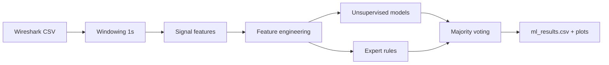

<!-- ===== Project Header ===== -->

# FlowSense-IDS

Hybrid network traffic anomaly detection from time-window signals.

<!-- Badges -->

<!-- Quick Links -->
<a href="#quick-start">Quick start</a> •
<a href="#pipeline">Pipeline</a> •
<a href="#signals-used">Signals</a> •
<a href="#outputs">Outputs</a> •
<a href="#limitations">Limitations</a>

---

## Overview

FlowSense-IDS is a small, course-friendly pipeline that converts packet logs into discrete-time signals (fixed windows) and flags suspicious windows using multiple unsupervised methods plus simple expert rules. The focus is on clarity, explainability, and presentation-ready outputs rather than production deployment.

## Highlights

| Item | Description |
|---|---|
| Goal | Flag unusual traffic windows using signals + hybrid detection |
| Input | Wireshark-exported CSV mapped with `columns.json` |
| Output | `ml_results.csv` + plots (timeline, model comparison, correlations) |
| Approach | Unsupervised models + expert rules + majority voting |

---

## Pipeline

