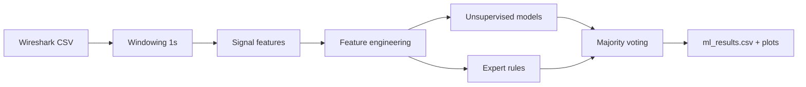

<!-- ===== Project Header ===== -->

<div align="center">

# FlowSense-IDS

<p align="center">
  
</p>


<!-- Quick Links -->
<p align="center">
  <a href="#overview"></a>
  <a href="#quick-start"></a>
  <a href="#signal-extraction"></a>
  <a href="#machine-learning"></a>
  <a href="#outputs"></a>
  <a href="#limitations"></a>
</p>

</div>

---
## Overview

**FlowSense-IDS** is a small, course-friendly pipeline that converts packet logs into discrete-time signals (fixed windows) and flags suspicious windows using multiple unsupervised methods plus simple expert rules. The focus is clarity, explainability, and presentation-ready outputs rather than production deployment.

### Highlights

| Item | Description |
|---|---|
| Goal | Flag unusual traffic windows using signals + hybrid detection |
| Input | Wireshark-exported CSV mapped with columns.json |
| Output | ml_results.csv + plots (timeline, model comparison, correlations) |
| Approach | Unsupervised models + expert rules + majority voting |

### Pipeline

Mermaid diagram source (optional; wrap it in a Mermaid block in your README if you want it rendered):

- Flow: Wireshark CSV → windowing (1 second) → signal features → feature engineering → unsupervised models + expert rules → majority voting → results (CSV + plots)
- Why signals + hybrid approach: Aggregating traffic into fixed windows makes intensity, diversity, and timing changes visible as simple signal statistics; combining multiple detectors improves robustness and produces more defensible outputs (votes, scores, and rule-based labels)

### Signals used

| Signal | What it captures | Why it helps |
|---|---|---|
| Packet count | Traffic intensity / bursts | Detect spikes and surges |
| Traffic volume | Bytes per window | Separates many-small vs few-large packets |
| Unique source IPs | Source diversity | Multi-source patterns |
| Source IP entropy | Concentration vs spread | Identifies skewed vs diverse sources |
| Time-interval variance | Timing irregularity | Bursty vs stable behavior |

### ML models used

| Model | Type | Purpose |
|---|---|---|
| Isolation Forest | Unsupervised | Detects outliers based on isolation |
| One-Class SVM | Unsupervised | Learns a boundary of normal behavior and flags deviations |
| KMeans | Clustering | Distance-based anomaly detection |
| Expert rules | Rule-based | Threshold-based labeling for interpretability |
| Ensemble voting | Fusion | Combines all detectors (majority vote) |

---

## Quick start

### 1) Install

**Ubuntu/Linux**:
```bash
pip3 install -r requirements.txt
```
**Windows/macOS**:
```bash
pip install -r requirements.txt
```

### 2) Build signals
```bash
python src/signal.py
```

### 3) Run detection
```bash
python src/ml_model.py
```
---
## Outputs

- `network_signals.csv` (generated): Window-level signals and basic features
- `ml_results.csv` (generated): Final results including:
  - `prediction` (1 = normal, -1 = anomaly)
  - `votes` (0..4)
  - `anomaly_score` (0..100)

Plots (generated):
- `assets/anomaly_detection_complete.png`
- `assets/model_comparison.png`
- `assets/feature_correlation.png`

<details>
  <summary>Column glossary (ml_results.csv)</summary>

- `prediction`: Final ensemble decision per window
- `votes`: How many detectors voted anomaly
- `anomaly_score`: Combined score (higher means more suspicious)
- `attack_type`: Expert-rule label (interpret as "X-like")

</details>
---
## Repository layout

| Path | Purpose |
|---|---|
| `src/` | Core pipeline code |
| `scripts/` | Optional helpers (e.g., synthetic dataset generator) |
| `data/` | Small demo inputs (avoid sensitive captures in public repos) |
| `assets/` | Screenshots used in the README |

---

## Limitations

- This project performs anomaly detection; it does not guarantee ground-truth attack identification
- With only `Time/Source/Length`, some attack claims should be treated as "X-like behavior" unless richer fields (dst/proto/ports) exist

